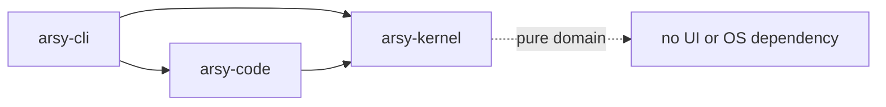

# Rust workspace

## Problem

One giant core makes privilege and dependency boundaries invisible; dozens of premature crates slow builds and make refactors ceremonial.

## Decision

Begin with three physical crates, matching existing ADR-0001, but enforce the following logical packages. Extract a package only when it crosses a process/privilege boundary, needs independent versioning, or materially improves parallel compilation/testing.

| Initial crate | Logical packages | Likely extraction gate |
|---|---|---|
| `arsy-kernel` | domain, events, protocol, store, model, context, prompt, capability, policy, agent | protocol/plugin ABI stabilizes |
| `arsy-code` | fs, search, syntax, LSP, DAP, edit, git, shell, sandbox, execution target | privileged worker or reusable server boundary |
| `arsy-cli` | service host, CLI, TUI | daemon and frontend release independently |

Later credible boundaries are `arsy-protocol`, `arsy-store`, `arsy-extension-api`, `arsy-sandbox-worker`, and `arsy-eval`; not the speculative 30-crate layout.

## Dependency choices

| Dependency | Why | Alternatives / implications |
|---|---|---|
| Tokio | process, network, timers, cancellation | async-std/smol have smaller ecosystems; constrain task ownership and avoid blocking pool abuse |
| serde + serde_json + toml | versioned wire/config formats | hand parsers add risk; reject unknown security-critical keys |
| tracing | structured spans across async work | log lacks causal spans; redact fields before emission |
| rusqlite | embedded SQLite, explicit connection control | sqlx adds async/build complexity; redb lacks SQL migrations/query tooling |
| zstd | large artifact compression | optional by content class; bound decompression ratios |
| ignore + globset + regex | Git-compatible walking and policy matching | centralize semantics; fuzz patterns and cap complexity |
| tree-sitter | incremental syntax across languages | LSP-only is slower/less available; grammar code is a supply-chain boundary |
| portable-pty | cross-platform PTY abstraction | platform APIs are fallback for missing controls |
| wasmtime + cap-std | sandboxed extension compute and capability I/O | native plugins are faster but unsafe; startup is amortized by pooling |
| reqwest + rustls | provider/MCP HTTP | avoid OpenSSL deployment variance; pin roots and bound bodies |
| axum + tokio-tungstenite | optional local HTTP/WS service | stdio/Unix socket stay simpler defaults |
| gix plus Git CLI | fast typed reads, behavior-compatible mutations | git2 uses libgit2 semantics; mutation remains CLI until conformance passes |

`tonic`, RocksDB, `nix`, and `windows-rs` are added only when gRPC, high-write storage, or platform workers demand them. `unsafe` is denied by default and isolated when unavoidable.

## Performance and maintenance

Feature-gate TUI, DAP, WASM, and remote transports. Maintain a minimum supported Rust version, lockfile, license policy, `cargo deny`, SBOM, and reproducible release pipeline. Benchmark compile time before extracting crates.
